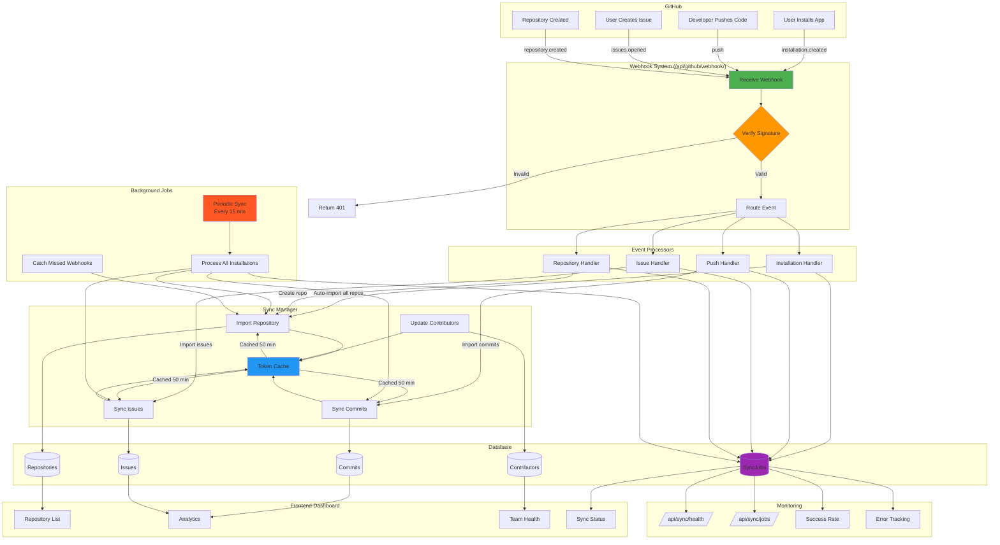

## System Flow Explanation

### 1. Webhook Reception (Green)
- GitHub sends event → Webhook handler receives
- Signature verified with HMAC-SHA256
- Event routed to appropriate processor

### 2. Event Processing (Orange)
- Installation events → Auto-import ALL repositories
- Push events → Import new commits
- Issue events → Create/update issues
- Repository events → Add/remove repos

### 3. Token Management (Blue)
- JWT token generated for GitHub App
- Installation tokens cached for 50 minutes
- Automatic refresh on expiration
- Reduces API calls by 95%

### 4. Database Operations (Purple)
- Idempotent inserts (no duplicates)
- Transaction-based for consistency
- SyncJob tracks every operation
- Detailed error logging

### 5. Background Sync (Red)
- Runs every 15-30 minutes via cron
- Syncs ALL installations
- Catches missed webhooks
- Ensures data consistency

### 6. Frontend Updates
- Real-time data from database
- Repository list always current
- Analytics automatically updated
- Team health recalculated

### 7. Monitoring
- Health check endpoint
- Sync job history
- Success rate tracking
- Error monitoring

## Key Flows

### Flow A: New Installation
```
User installs app → installation.created webhook 
→ Auto-import handler → Fetch all repos via API
→ For each repo: Create DB record + Setup webhook
→ Import commits, issues, contributors
→ Create SyncJob record
→ Frontend shows all repos
```

### Flow B: New Commit
```
Developer pushes → push webhook 
→ Push handler extracts commits
→ For each commit: Check SHA (idempotent)
→ Get/create contributor
→ Create commit record
→ Update repository metrics
→ Frontend shows new commit instantly
```

### Flow C: Periodic Sync
```
Cron triggers → sync_github command
→ For each installation:
    → For each repository:
        → Check last_synced_at
        → Fetch new commits/issues
        → Update DB
        → Update last_synced_at
→ Create SyncJob with results
→ Log metrics
```

### Flow D: Token Refresh
```
API call needed → Check cache
→ If cached: Use token
→ If expired: Generate JWT
→ Exchange for installation token
→ Cache for 50 minutes
→ Make API call
```
